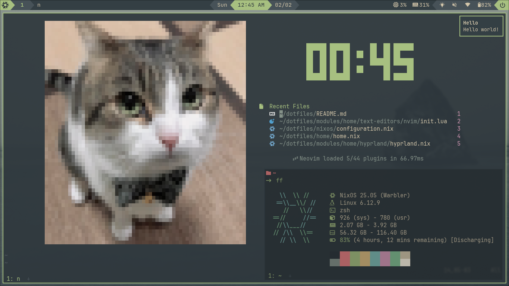

  

<h1 align='center'>NixOS</h1>

## WSL

This branch is specifically tailored for use within Windows Subsystem for Linux (WSL). [NixOS-WSL](https://github.com/nix-community/NixOS-WSL)

## Info

| Component     |            |
| ------------- | ---------- |
| Shell         | Zsh        |
| Terminal      | WezTerm    |
| Editor        | Neovim     |
| File Explorer | Yazi       |
| Theme         | Everforest |
